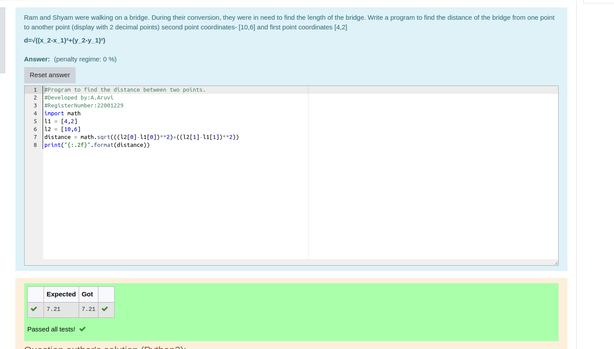

# DISTANCE-BETWEEN-TWO-POINTS

## AIM:
To write a python program to find the distance two 2 points

## ALGORITHM:

### Step 1: 

Enter the input values

### Step 2: 

substitute the values

### Step 3: 
Substitute the values in the distance formula  

### Step 4: 

Find distance between two points


### Step 5: 
End the program

### PROGRAM:
```python
#Program to find the distance between two points.
#Developed by:A.Aruvi 
#RegisterNumber:22001229
import math 
l1 = [4,2]
l2 = [10,6]
distance = math.sqrt(((l2[0]-l1[0])**2)+((l2[1]-l1[1])**2))
print("{:.2f}".format(distance))
```
  


### OUTPUT:



### RESULT:
Thus the distance between two points is executed successfully.
